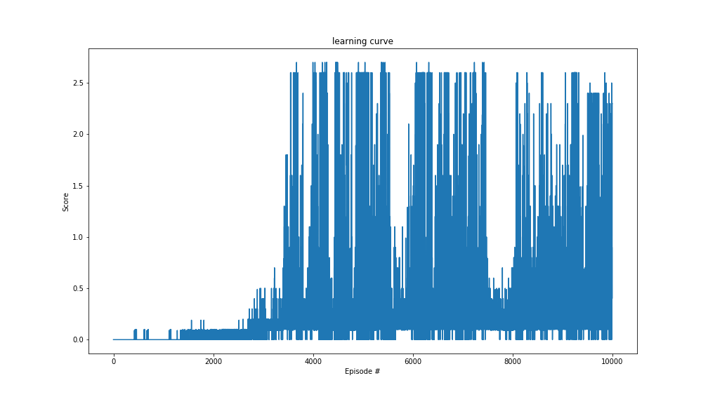

# Report
-------------

In the following, we provide a detailed write up of the solution of the _collaborative competition_.
We have implemented an maddpg, i.e. multi agent deep deterministic policy gradient, similar to the one outlined and implemented in [Lowe, Wu, et. al.](https://arxiv.org/abs/1706.02275).
The idea behind MADDPG is to leverage the  successful ideas behind DDPG [Lillicrap, Hunt, et. al.](http://arxiv.org/abs/1509.02971), which themselves build up on deep q-learning networks DQN [Mnih, Kavukcuoglu, Silver, et. al.](http://www.nature.com/articles/nature14236), to problems with still continuous action spaces but have now more than one agent. 

As the authors of the MADDPG paper show in their appendix, MADDPGs still use the key features of the DDPG approach:
* memory replay: randomization over the data to remove correlations in the observation sequences and to be data efficient;
* target networks: the networks are trained with target networks to give a consistent target during temporal learning (to avoid dangerous correlations); The updates of the target networks are done softly, i.e. the weights of the actual actor and critic networks are slowly propagated to the targets.
* To circumvent the problem of optimization for DQN in combination with continuous action spaces, an additional neural network is introduced, i.e. the actor, which learns to approximate optimal action directly. The Q-network is still of importance because it serves as a guidance, i.e. a critic, for the updates of the policy (actor) network.

Next, we describe in detail how the learning is done and implemented
in our MADDPG.

## The Learning Algorithm

The most convenient way to give the learning algorithm is in terms of pseudocode:

**Algorithm for multi agent deep deterministic policy gradient approach with experience replay, soft update, and N agents.**:

Initialize critic networks (action-value functions) $Q_i(s, a_1, \ldots, a_N|\theta^Q)$ and actors $\mu_i(s|\theta^\mu)$ with random weights $\theta^Q$ and $\theta^\mu$ for $i=1,\ldots, N$.

Initialize target networks $\hat Q_i$ and $\hat \mu_i$ with weights $\theta^{\hat Q} \leftarrow \theta^Q$, $\theta^{\hat \mu} \leftarrow \theta^\mu$ for $i=1,\ldots, N$.

Initialize replay memory $D$ to capacity ReplayBufferSize

**For** episode=1, MaxEpisodes **do**
>  Initialize/reset environment and get first state $s_1$
>
> Initialize a random process (noise) $\mathcal N$ for action exploration
>
> **For** t=1, T **do**
>> For each agent $i$, select action $a^i_t = \mu_i(s_t|\theta^\mu) + \mathcal N_t$ according to the current policy and exploration noise
>>
>> Execute actions $a_t = (a^1_t, \ldots, a^N_t)$ and observe rewards $r_t$ and observe new state $s_{t+1}$
>>
>> Store transition $(s_t,\, a_t,\, r_t,\, s_{t+1})$ in $D$
>> 
>> $s_t \leftarrow s_{t+1}$
>>
>> **For** agent i=1, N **do**
>>>
>>> Sample a random minibatch of $S$ transitions $(s_j,\,a^i_j,\,r^j_i,\,s_{i+1})$ from $D$
>>>
>>> Set $y^j = r^j_i + \gamma\, \hat Q_i(s_{i+1},\,\hat \mu_i(s_{i+1}|\theta^{\hat\mu})| \theta^{\hat Q})
>>>
>>> Update critic by minimizing the loss: $L = \tfrac1S\sum_j(y_j - Q_i(s_i,\, a^i_j|\theta^Q))^2
>>>
>>> Update the actor policy using the sampled policy gradient:
>>>
>>> $$ \nabla_{\theta^\mu} J \approx \frac1S \sum_j\nabla_{a^i} Q_i(s,\,a|\theta^Q)|_{s=s_i,\,a^i=\mu_i(s_i)}\nabla_{\theta^\mu}\mu_i(s|\theta^\mu)|_{s_i}$$
>>>
>> **End For**
>> 
>> Update the target networks (soft update):
>>
>> $$ \theta^{\hat Q} \leftarrow \tau \theta^Q + (1 - \tau)\theta^{\hat Q} $$
>>
>> $$ \theta^{\hat \mu} \leftarrow \tau \theta^\mu + (1 - \tau)\theta^{\hat\mu}$$
>>
> **End For**

**End For**

The following table summarizes the values for all the parameters which are used during training:

|ReplayBufferSize| BatchSize |Gamma | Learning Rate Actor| Learning Rate Critic| $\tau$ | MaxEpisodes | Weight Decay | 
|------------------|---------|------|--------------------|--------------------|-----|------|---|
| 100000           | 128     | 1.00 |      0.0002        |      0.0002        |0.001|1000 | 0.0001 |

For the exploratory noise the parameters were:

| $\mu$ | $\theta$ | $\sigma$ |
|-------|----------|----------|
|0.     |   0.15   |    0.1   | 

The implementation of the above algorithm was done in a function called `maddpg`. This function makes us of five classes: `MultiAgentDDPG`, `DDPGAgent`, `OUNoise`, `ReplayBuffer`, `Actor` and `Critic`.
* The `ReplayBuffer` class has the functions: `add` and `sample`;
* The `OUNoise` class has the functions: `reset` and `sample`;
* `Actor` and `Critic`: these classes define the DNN which approximate the optimal policy (function) and the action-value function, respectively, and are described in more detail below;
* The `DDPGAgent` class has the functions: `step`, `act`, `learn`, and `soft_update` where `act` gives $a_t$ and `step` calls, as in the order of the pseudocode,  `add`, `sample`, `learn`, and `soft_update`.
* The `MultiAgentDDPG` class is build up from the `DDPGAgent` class and has the functions `act` and `step` which call the agents individual `act` and `step` functions.

To see the performance increase of our agents we track the scores for all episodes they are playing. These scores are the return values of the `maddpg` function.

### Learning Curve

In this graphic we see the learning performance of our algorithm. We note that a mean score of 0.5 (over 100 consecutive episodes) is reached around 3500 episodes. We continued with training till 10000 episodes though the maximum performance of 1.37 appeared around 5500 episodes.

## The Architecture of the Actor and Critic Network

## Ideas for Future Work

